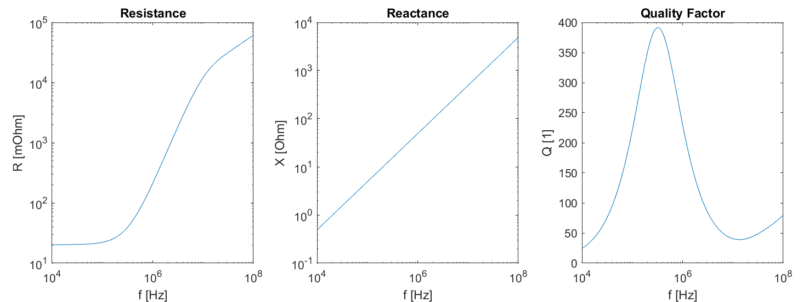

# Litz Wire Losses with FEM and MATLAB

This **MATLAB** tool extracts the **losses of a litz wire winding** from the **field patterns**.
The losses are computed in the **frequency domain with Bessel functions**.
The field patterns can be extracted with any simulation software (e.g. COMSOL, ANSYS, OpenFOAM).
The tool be used to compute the losses of different components, e.g., **inductors, transformers, and chokes**.

The method features several advantages:
* A **reduced computational cost**, since the discrete strands are not modeled
* The **mesh** can be **coarse**, independent of the skin depth
* Method valid **up to several megahertz**
* The litz wire can feature **an arbitrary shape**

The following limitations exist:
* The impact of the eddy current on the magnetic field is neglected
* The litz wire is composed of round strands
* The litz wire is ideal (insulated and perfectly twisted strands)
* The litz wire is defined with a fill factor, the exact position of the strands is not considered

The following field patterns are required:
* Integral of the square of the current density over the winding (for skin losses)
* Integral of the square of the magnetic field over the winding (for proximity losses)

## Example

A simple circular air coil realized with litz wire is considered:
* [run_winding_fem.m](run_winding_fem.m) - Compute homogenized material parameters for a litz wire (with FEM)
* [run_winding_circuit.m](run_winding_circuit.m) - Extract the winding equivalent circuit (losses and inductance)

### Winding Current Density and Magnetic Field

    
    

### Winding Equivalent Circuit

    

## Compatibility

The tool is tested with the following MATLAB setup:
* Tested with MATLAB R2018b or 2019a
* No toolboxes are required.
* Compatibility with GNU Octave not tested but probably easy to achieve.

Any numerical simulation software (e.g. COMSOL, ANSYS, OpenFOAM) can be used for generating the field patterns.
For the included example, COMSOL 5.4 or 5.5 has been used.

## References

References for the litz wire losses:
* Guillod, T. / Litz Wire Losses: Effects of Twisting Imperfections / COMPEL / 2017
* Muehlethaler, J. / Modeling and Multi-Objective Optimization of Inductive Power Components / ETHZ / 2012
* Ferreira, J. / Electromagnetic Modelling of Power Electronic Converters /Kluwer Academics Publishers / 1989.

## Author

* **Thomas Guillod, ETH Zurich, Power Electronic Systems Laboratory** - [GitHub Profile](https://github.com/otvam)

## License

* This project is licensed under the **BSD License**, see [LICENSE.md](LICENSE.md).
* This project is copyrighted by: (c) 2016-2020, ETH Zurich, Power Electronic Systems Laboratory, T. Guillod.
